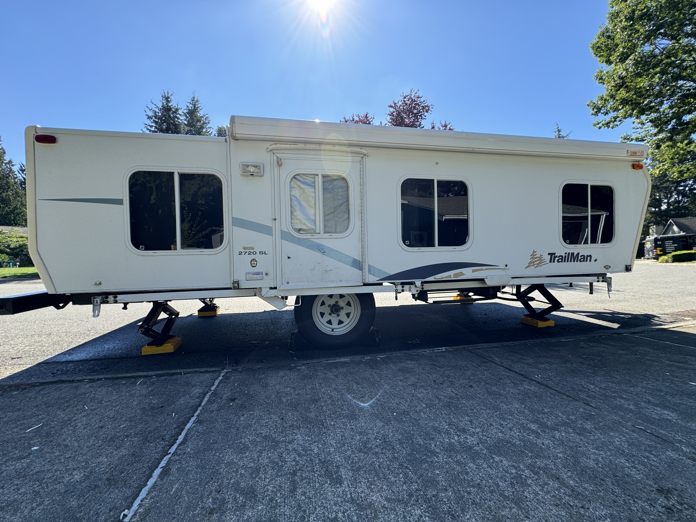
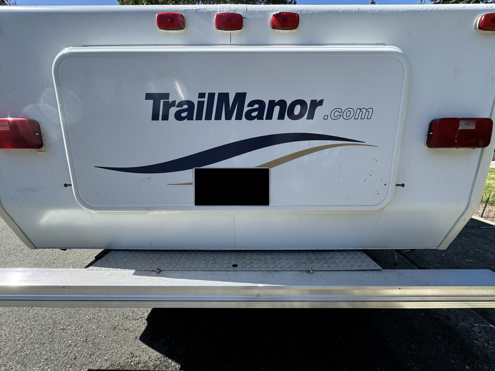
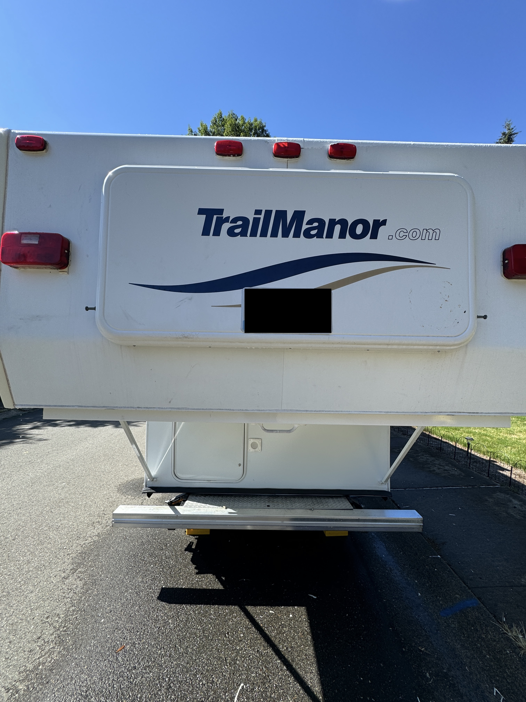

# 2003 TrailManor 2720 SL

No problems other than the roof AC not working. It will come with a replacement air conditioner. It trailers behind really well. They're REALLY built well and the manufacturer has thought of everything to make it as easy as possible to enjoy the outdoors!

# Specs/Options

  - Length Folded: 20'3"
  - GVWR: 4074 lbs
  - Unloaded Vehicle Weight: 2680 lbs
  - Cargo carrying capacity: 1188 lbs
  - Furnace: Std/(1) 16,000 BTU
  - Ext. wall material: Aluminum
  - A/C: 13,500 BTU(Not working)
  - Primary insulation: Polystyrene foam
  - Underbelly material: Aluminum
  - LP(Liquid Propane) gas capacity: 10 gal
  - Std. floor covering(s): Carpet/vinyl
  - Freshwater capacity: 20 gal
  - Std. window covering(s): Curtains
  - Stove: 3 burners
  - Oven: Std
  - Water-heater capacity: Std/6
  - Beds: 60″x78″/48″x75″
  - Refrigerator: Norcold/3-way(Electrid(AC)/Electric(DC)/  - Propane)
  - Slideout room(s): None
  - Power source(s): 120AC/12DC/LPG
  - Bath: Lavatory/tub/shower
  - Options: Awning, TV antenna, AM/FM/CD

# Maintenance Items in 2024:

1. TropiCool'ed Roof(limited lifetime warranty waterproofing)
2. 4 new stabilizer level jacks(each has a 6000 lbs. capacity)
3. 3 new trailer tires from Les Schwab(1 is for the spare)
4. Made blackout curtains that works REALLY well! We still have the original curtains if you want them
5. All interior lights have led bulbs which makes it brighter
6. Interior painted white to brighten the inside
7. Tinted windows to give even more privacy and heat reduction
8. Comes with a foam mattress(short queen size)
9. Maximized the shower area

